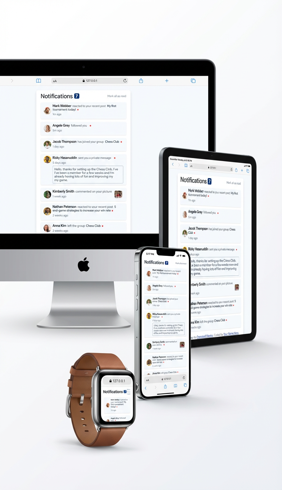

# Frontend Mentor -  🔔 Notifications page solution

This is a solution to the [Notifications page challenge on Frontend Mentor](https://www.frontendmentor.io/challenges/notifications-page-DqK5QAmKbC). Frontend Mentor challenges help you improve your coding skills by building realistic projects. 

## 📑 Table of contents

- [Overview](#overview)
- [Screenshot](#screenshot)
- [The challenge](#the-challenge)
- [Features](#🚀-features)
- [Technologies used](#🧩-technologies-used)
- [How it works](#what-i-learned)
- [Futture Improvement](#📌-future-improvements)
- [Links](#links)
- [Author](#💡-author)
- [Acknowledgments](#🙏-acknowledgements)
- [License](#📄-license)

## 📖 Overview

A clean, interactive notification interface built with **HTML**, **CSS**, and **JavaScript**.  
The project features **dynamic rendering**, **toggle read/unread**, **mark all read**, and a fully responsive UI.

## ScreenShot

## The challenge

Your challenge is to build out this notifications page and get it looking as close to the design as possible.

You can use any tools you like to help you complete the challenge. So if you've got something you'd like to practice, feel free to give it a go.

Your users should be able to:

- Distinguish between "unread" and "read" notifications
- Select "Mark all as read" to toggle the visual state of the unread notifications and set the number of unread messages to zero
- View the optimal layout for the interface depending on their device's screen size
- See hover and focus states for all interactive elements on the page

## 🚀 Features

### ✔️ Dynamic Rendering  
All notifications are generated from a JavaScript dataset, keeping the UI flexible and maintainable.

### ✔️ Toggle Read / Unread  
Clicking any notification toggles it between `read` and `unread`:

- Adds/removes visual highlight
- Updates the unread count
- Persists state within the session

### ✔️ Mark All Read  
A single button marks all notifications as read at once.  
The UI updates instantly without page reload.

### ✔️ Real-Time Unread Count  
The unread counter updates automatically based on the dataset state.

### ✔️ Fully Responsive Layout  
Designed to work smoothly on both mobile and desktop screens.

### ✔️ Clean, Debounced Rendering  
DOM rendering is handled through a controlled render function to avoid duplicates, re-render glitches, or state mismatches.

---

## 🧩 Technologies Used

- **HTML5**
- **CSS3** (Flexbox, responsive layout)
- **Vanilla JavaScript (ES6+)**
- DOM manipulation
- Array methods (`forEach`, `find`, `filter`, etc.)

---

## 🛠 How It Works

### 🔹 Dataset  
 #### Notifications are stored as an array of objects containing:
  
  - id: String,
  - image: image,
  - name: String,
  - action: Sting,
  - message: String,
  - period: String,
  - type: String
  

### 🔹 Render Function

  #### The render() function:

  - Clears the container

  - Loops through the dataset

  - Builds and appends notification elements

  - Applies correct classes based on the read state

### 🔹 Toggle Read Logic

 #### A click on any notification switches:

  - Toggles CSS classes

### 🔹 Mark All Read

 ### Loops through the entire array and sets all read = true.

### 🎯 What I Learned

  - How to structure data using objects + arrays

  - How to cleanly re-render the DOM

  - Avoiding duplicate DOM nodes

  - Handling UI state with boolean flags

  - Debugging real-world toggle logic

  - Managing multiple event listeners

  - Working with ID-based data mapping

  - Writing scalable front-end logic

### 📌 Future Improvements

 - Add animations (using Motion.dev or CSS transitions)

 - Store read/unread state in localStorage

 - Add API simulation (fetch notifications from a JSON file)

 - Dark mode toggle

 - Accessibility improvements (ARIA labels)

### Links

- Solution URL: [Add solution URL here]()
- Live Site URL: [Add live site URL here](https://smartee-17.github.io/Notification-frontend-challenge/notifications-page-main/)

## 💡 Author

*** Smartee-17 ***
A front-end developer learning advanced JavaScript and building UI projects.

- Frontend Mentor - [Smartee-17](https://www.frontendmentor.io/profile/yourusername)
- Github - [Smartee-17](https://www.twitter.com/yourusername)

## 🙏 Acknowledgements

Special thanks to **OpenAI (ChatGPT)** for assisting with debugging, explanations, and design help throughout the challenge.

## 📄 License

This project is for educational and personal portfolio use.
